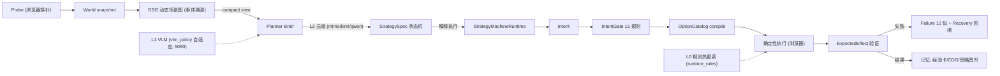

# fusion-harness 文档

## 架构（三层 + 确定性/记忆/治理）



## 信任控制流
- **VLM 是观察者**（只读不决策，vlm_policy 决定何时观察）
- **L2 是策略作者**（生成 StrategySpec，经 contract 校验）
- **确定性层是执行者**（IntentGate 拒绝不合规 → Option 编译 → 监督执行）
- **L0 是零延迟兜底**（规则快速路径，参数可热更新）

## 与 gah / smallgameagent 的关系

| 层 | 来自 |
|---|---|
| L2 多 provider + normalizer | smallgameagent |
| L1 VLM /describe + vlm_policy + QLoRA | smallgameagent |
| L0 规则 + rule_update 热更新 | smallgameagent |
| Option / IntentGate / Failure / Recovery | gah（Python 移植） |
| 阶段锁定 + StrategySpec 状态机 | gah（Python 移植） |
| DSG / 经验卡 / CDG / 策略晋升 | gah（Python 移植） |
| 多游戏验证 | gah（Python 移植） |

## 实验记录
- `results/three-way-comparison.md` — 三方对比（A 我们 / B gah-mimo / C 融合）
- `results/sample_game_1f1c7b6176fe.png` — 样例游戏画面（whiteout-survival）

## Release 机制（对齐 gah release/）

融合框架遵循 gah 的可发布性思想：
- **版本化**：`fusion/__init__.py` 的 `__version__` + 每次提交的 git tag（v0.1.0）
- **完整性校验**：release 时生成模块 SHA-256 清单（`release.manifest.json`），运行前校验，防篡改/混入
- **回归门**：`pytest tests/` 全绿才允许 release（当前 11 测试）
- **便携运行**：`fusion-harness/` 自包含（无 node 依赖），Python 3.10+ 即插即用

生成 release 清单：
```bash
python -c "
import hashlib, json
from pathlib import Path
manifest = {}
for p in Path('fusion').rglob('*.py'):
    manifest[str(p)] = hashlib.sha256(p.read_bytes()).hexdigest()
Path('release.manifest.json').write_text(json.dumps(manifest, indent=2))
print('manifest written:', len(manifest), 'files')
"
```
